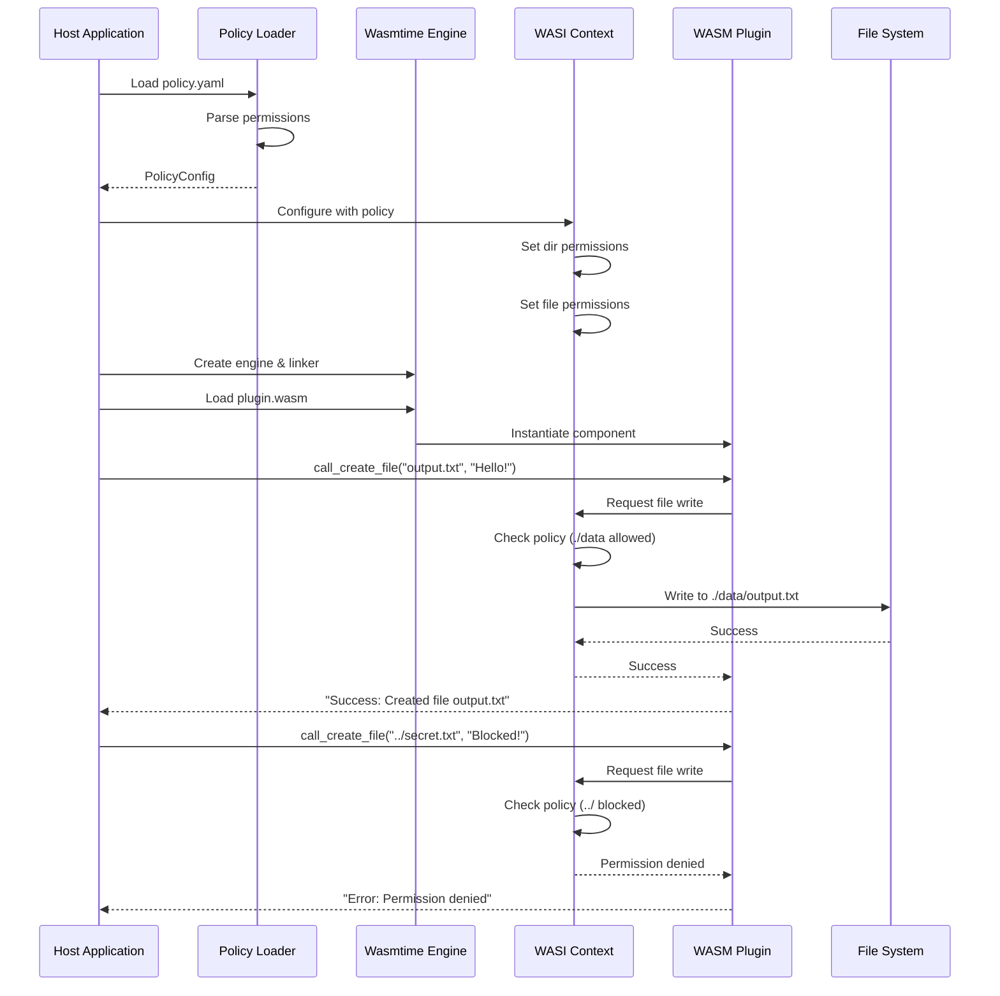
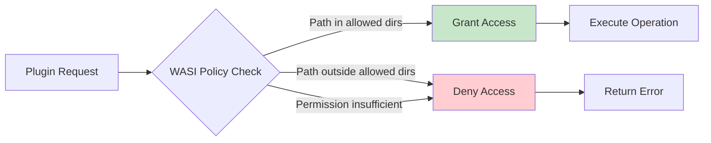
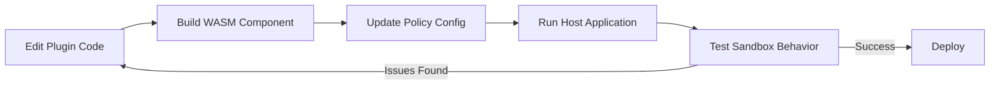

# WASM Plugin Sandboxing Framework

## Overview

This sandboxing framework provides a secure execution environment for plugins using WebAssembly Component Model (WASM-P2). It enforces file system access policies and isolates plugin execution from the host system.

## Architecture Diagram

```mermaid
graph TB
    subgraph "Host System"
        A[Main Application<br/>src/main.rs] --> B[Policy Loader<br/>policy_loader.rs]
        B --> C[YAML Policy Config<br/>config/policy.yaml]
        A --> D[Wasmtime Engine]
        D --> E[WASI Context]
        E --> F[Resource Table]
    end
    
    subgraph "Sandbox Boundary"
        D --> G[WASM Component<br/>plugin.wasm]
    end
    
    subgraph "Plugin"
        G --> H[Plugin Implementation<br/>plugin/src/lib.rs]
        H --> I[WIT Interface<br/>world.wit]
    end
    
    subgraph "Allowed Resources"
        E -.->|Controlled Access| J[./data Directory]
        J --> K[sample.txt]
        J --> L[output.txt]
    end
    
    subgraph "Blocked Resources"
        M[../secret.txt]
        N[/etc/passwd]
    end
    
    E -.->|Access Denied| M
    E -.->|Access Denied| N
    
    style G fill:#e1f5ff
    style E fill:#fff4e1
    style J fill:#e8f5e9
    style M fill:#ffebee
    style N fill:#ffebee
```

## System Flow



## Directory Structure

```
sandboxing/
├── Cargo.toml              # Main project configuration
├── README.md               # This file
├── config/
│   └── policy.yaml         # Sandbox policy configuration
├── data/                   # Allowed directory for plugin access
│   ├── sample.txt
│   └── output.txt
├── docs/
│   └── limitations_sandboxing.md
├── plugin/                 # WASM plugin source
│   ├── Cargo.toml
│   ├── Makefile
│   ├── src/
│   │   ├── lib.rs         # Plugin implementation
│   │   └── bindings.rs    # Generated bindings
│   └── wit/
│       └── world.wit      # WebAssembly Interface Types
├── src/
│   ├── main.rs            # Host application entry point
│   ├── lib.rs             # Library exports
│   └── policy_loader.rs   # Policy configuration loader
└── tests/
    ├── policy_tests.rs
    └── common/
```

## Quick Start

### Prerequisites

```bash
# Install Rust toolchain
rustup target add wasm32-wasip2

# Install cargo-component for WASM Component Model
cargo install cargo-component
```

### Building the Plugin

```bash
cd plugin
cargo component build --release
```

This generates: `plugin/target/wasm32-wasip2/release/plugin.wasm`

### Running the Host Application

```bash
cd ..
cargo run
```

## Configuration

### Policy Configuration (`config/policy.yaml`)

```yaml
plugin:
  name: "samplePlugin"
  sandbox:
    type: "wasm"
    wasm_version: "p2"
    policy:
      dir_name: ["./data"]      # Allowed directories
      permissions:
        dir: ["read"]            # Options: "read" or "mutate"
        file: ["read"]           # Options: "read" or "write"
```

**Permission Levels:**
- **dir**: `read` (read-only) or `mutate` (full directory operations)
- **file**: `read` (read-only) or `write` (read/write access)

## Key Components

### 1. Host Application (`src/main.rs`)

The host application:
- Loads the policy configuration
- Configures the WASI context with permissions
- Instantiates the WASM plugin
- Calls plugin functions

```rust
let policy = load_policy("config/policy.yaml")?;
let wasi = configure_wasi_from_policy(&policy)?;
let plugin = Plugin::instantiate(&mut store, &component, &linker)?;
let result = plugin.example_plugin_policy()
    .call_create_file(&mut store, "output.txt", "Hello!")?;
```

### 2. Policy Loader (`src/policy_loader.rs`)

Parses YAML configuration and creates WASI context:

```rust
pub fn configure_wasi_from_policy(policy: &PolicyConfig) 
    -> Result<WasiCtx, Box<dyn std::error::Error>>
```

### 3. Plugin Interface (`plugin/wit/world.wit`)

Defines the plugin API using WebAssembly Interface Types:

```wit
interface policy {
    check-key: func(json: string, key: string) -> string;
    create-file: func(filename: string, content: string) -> string;
}
```

### 4. Plugin Implementation (`plugin/src/lib.rs`)

Implements the WIT interface:

```rust
impl Guest for Component {
    fn check_key(json: String, key: String) -> String { ... }
    fn create_file(filename: String, content: String) -> String { ... }
}
```

## Security Model



### Sandbox Guarantees

1. **File System Isolation**: Plugins can only access pre-opened directories
2. **Permission Enforcement**: Read/write permissions enforced at WASI level
3. **Memory Isolation**: WASM linear memory isolated from host
4. **No Network Access**: Unless explicitly granted via WASI
5. **Deterministic Execution**: WASM provides predictable behavior

### Example: Blocked Access

```rust
// ✅ Allowed: Writing to ./data/output.txt
plugin.call_create_file(&mut store, "output.txt", "Hello!")?;
// Result: "Success: Created file output.txt"

// ❌ Blocked: Writing outside allowed directory
plugin.call_create_file(&mut store, "../secret.txt", "Blocked!")?;
// Result: "Error: Permission denied"
```

## Usage Examples

### Example 1: Check JSON Key

```rust
let json = r#"{"status": "allow"}"#;
let result = plugin.example_plugin_policy()
    .call_check_key(&mut store, json, "status")?;
// Returns: "allow" or "deny" based on value
```

### Example 2: Create File with Permissions

```rust
// Configure policy for write access
// policy.yaml:
//   permissions:
//     file: ["write"]

let result = plugin.example_plugin_policy()
    .call_create_file(&mut store, "output.txt", "Hello World!")?;
println!("{}", result);
// Output: "Success: Created file output.txt"
```

## Testing

```bash
# Run all tests
cargo test

# Run specific test
cargo test policy_tests
```

## Limitations

See `docs/limitations_sandboxing.md` for current limitations:

- **Synchronous Only**: WIT doesn't support async/await semantics yet
- **WASI-P2 Required**: Uses WebAssembly Component Model features
- **Limited I/O**: Only file system operations currently supported

## Development Workflow



## Troubleshooting

### Plugin Build Fails
```bash
# Ensure correct target installed
rustup target add wasm32-wasip2
cargo component build --release
```

### Permission Denied Errors
- Check `config/policy.yaml` has correct directory paths
- Verify permissions are set to `"write"` for file modifications
- Ensure paths are relative to the host application's working directory

### WASM Component Not Found
```bash
# Build plugin first
cd plugin && cargo component build --release
# Verify output exists
ls target/wasm32-wasip2/release/plugin.wasm
```

## References

- [WebAssembly Component Model](https://github.com/WebAssembly/component-model)
- [Wasmtime Documentation](https://docs.wasmtime.dev/)
- [WASI Preview 2](https://github.com/WebAssembly/WASI/blob/main/preview2/README.md)
- [WIT (WebAssembly Interface Types)](https://github.com/WebAssembly/component-model/blob/main/design/mvp/WIT.md)

---

**Note**: This sandboxing framework is designed for the ContextForge Plugins Framework to provide secure, isolated execution of untrusted plugin code.