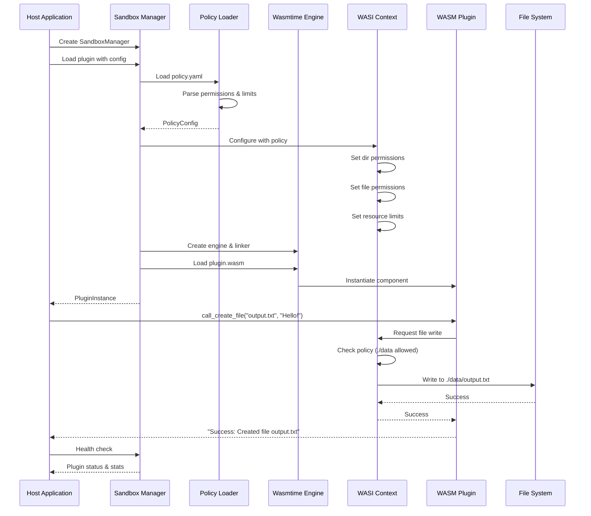
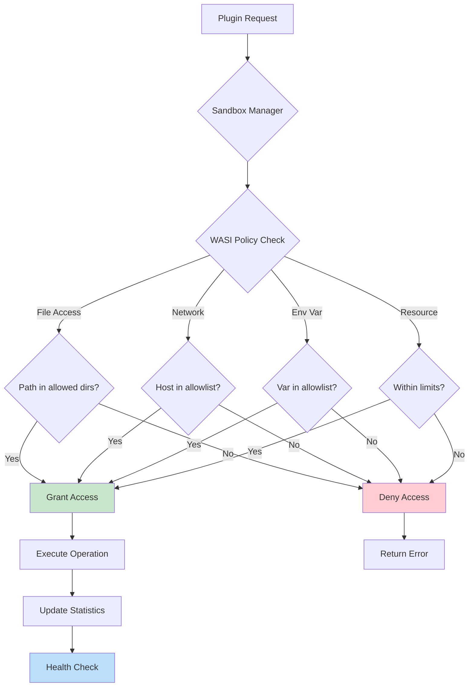
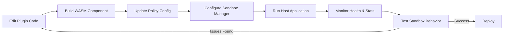

# WASM Plugin Sandboxing Framework

## Overview

This sandboxing framework provides a secure execution environment for plugins using WebAssembly Component Model (WASM-P2). It enforces file system access policies, network restrictions, resource limits, and isolates plugin execution from the host system.

**NEW**: Now includes a comprehensive **Sandbox Manager** for managing multiple plugin instances with lifecycle control, health monitoring, and resource tracking.

## System Flow



## Directory Structure

```
sandboxing/
├── Cargo.toml              # Main project configuration
├── README.md               # This file
├── README_SANDBOX_MANAGER.md  # Detailed sandbox manager docs
├── config/
│   └── policy.yaml         # Sandbox policy configuration
├── data/                   # Allowed directory for plugin access
│   ├── sample.txt
│   └── output.txt
├── docs/
│   ├── limitations_sandboxing.md
│   ├── resource_limits.md
│   ├── environment_variables.md
│   ├── ip_address_filtering.md
│   ├── socket_level_filtering.md
│   └── clock_access_policies.md
├── examples/
│   └── multi_plugin_demo.rs   # Multi-plugin management example
├── plugin/                 # WASM plugin source
│   ├── Cargo.toml
│   ├── Makefile
│   ├── src/
│   │   ├── lib.rs         # Plugin implementation
│   │   └── bindings.rs    # Generated bindings
│   └── wit/
│       └── world.wit      # WebAssembly Interface Types
├── src/
│   ├── main.rs            # Host application with sandbox manager
│   ├── lib.rs             # Library exports
│   ├── policy_loader.rs   # Policy configuration loader
│   └── sandbox_manager.rs # NEW: Multi-plugin lifecycle manager
└── tests/
    ├── policy_tests.rs
    └── common/
```

## Quick Start

### Prerequisites

```bash
# Install Rust toolchain
rustup target add wasm32-wasip2

# Install cargo-component for WASM Component Model
cargo install cargo-component
```

### Building the Plugin

```bash
cd plugin
cargo component build --release
```

This generates: `plugin/target/wasm32-wasip2/release/plugin.wasm`

### Running the Host Application

```bash
cd ..
# Run the main demo with sandbox manager
cargo run

# Run the multi-plugin example
cargo run --example multi_plugin_demo
```

## NEW: Sandbox Manager

The Sandbox Manager provides comprehensive lifecycle management for multiple plugin instances.

### Key Features

- ✅ **Multi-plugin management** - Load and run multiple plugins simultaneously
- ✅ **Lifecycle control** - Start, stop, pause, resume, restart plugins
- ✅ **Resource monitoring** - Track fuel consumption, memory, calls, failures
- ✅ **Health checks** - Monitor plugin health automatically
- ✅ **Security policies** - Enforce resource limits and access controls
- ✅ **Thread-safe** - Concurrent access with Arc/RwLock/Mutex
- ✅ **Statistics** - Comprehensive metrics collection
- ✅ **Auto-restart** - Configurable automatic restart on failure

### Quick Example

```rust
use sandboxing::sandbox_manager::{PluginConfig, SandboxManager};
use std::path::PathBuf;

// Create manager
let manager = SandboxManager::new()?;

// Configure and load plugin
let config = PluginConfig {
    id: "my-plugin".to_string(),
    name: "My Plugin".to_string(),
    wasm_path: PathBuf::from("plugin.wasm"),
    policy_path: PathBuf::from("policy.yaml"),
    auto_restart: true,
    max_restart_attempts: 3,
};

let plugin_id = manager.load_plugin(config).await?;

// Get plugin instance
let plugin = manager.get_plugin(&plugin_id).await?;

// Execute operations
let store = plugin.get_store();
let plugin_guard = plugin.get_plugin();
// ... call plugin functions ...

// Lifecycle management
manager.pause_plugin(&plugin_id).await?;
manager.resume_plugin(&plugin_id).await?;

// Health check
let health = manager.health_check_all().await;

// Get statistics
let stats = manager.get_all_stats().await;

// Cleanup
manager.unload_plugin(&plugin_id).await?;
```

For detailed documentation, see [README_SANDBOX_MANAGER.md](README_SANDBOX_MANAGER.md).

## Configuration

### Policy Configuration (`config/policy.yaml`)

```yaml
plugin:
  name: "samplePlugin"
  sandbox:
    type: "wasm"
    wasm_version: "p2"
    policy:
      dir_name: ["./data"]      # Allowed directories
      permissions:
        dir: ["read"]            # Options: "read" or "mutate"
        file: ["read"]           # Options: "read" or "write"
      
      # Network access control
      allowed_hosts:
        - "httpbin.org"
        - "api.example.com"
        - "127.0.0.1"
        - "192.168.1.0/24"      # CIDR ranges supported
      
      # Environment variable filtering
      allowed_env_vars:
        - "PATH"
        - "USER"
        - "HOME"
      
      # Resource limits
      resource_limits:
        max_memory_bytes: 104857600    # 100 MB
        max_fuel: 1000000              # CPU cycles
        cpu_timeout_ms: 5000           # 5 seconds
        wall_clock_timeout_ms: 10000   # 10 seconds
      
      # Socket-level policies
      socket_policy:
        tcp:
          allowed_destinations:
            - ip: "192.168.1.0/24"
              ports: [80, 443]
          max_connections: 10
        restrictions:
          block_privileged_ports: true
          allow_bind: true
          allow_listen: false
      
      # Clock access policies
      clock_policy:
        allow_monotonic_clock: true
        allow_wall_clock: true
        min_resolution_ns: 1000000     # 1ms resolution
        max_queries_per_second: 1000
```

**Permission Levels:**
- **dir**: `read` (read-only) or `mutate` (full directory operations)
- **file**: `read` (read-only) or `write` (read/write access)

## Key Components

### 1. Sandbox Manager (`src/sandbox_manager.rs`) - NEW

Manages multiple plugin instances with lifecycle control:

```rust
pub struct SandboxManager {
    // Manages multiple plugin instances
}

pub struct PluginInstance {
    // Individual plugin with status, stats, lifecycle
}

pub enum PluginStatus {
    Initializing,
    Running,
    Paused,
    Stopped,
    Failed(String),
}

pub struct PluginStats {
    pub total_calls: u64,
    pub failed_calls: u64,
    pub fuel_consumed: u64,
    pub uptime: Duration,
    // ...
}
```

### 2. Host Application (`src/main.rs`)

Now uses the Sandbox Manager for plugin orchestration:

```rust
let manager = SandboxManager::new()?;
let plugin_id = manager.load_plugin(config).await?;
let plugin_instance = manager.get_plugin(&plugin_id).await?;

// Execute operations with statistics tracking
let result = plugin.call_create_file(&mut store, "output.txt", "Hello!")?;
plugin_instance.update_stats(true, fuel_consumed).await;

// Lifecycle management
manager.pause_plugin(&plugin_id).await?;
manager.health_check_all().await;
```

### 3. Policy Loader (`src/policy_loader.rs`)

Parses YAML configuration and creates WASI context with security policies:

```rust
pub fn load_policy(path: &str) -> Result<PolicyConfig>;
pub fn build_wasi_ctx(policy: &PolicyConfig) -> Result<WasiCtx>;
pub fn is_host_allowed(host: &str, allowed: &[String]) -> bool;
```

### 4. Plugin Interface (`plugin/wit/world.wit`)

Defines the plugin API using WebAssembly Interface Types:

```wit
interface policy {
    check-key: func(json: string, key: string) -> string;
    create-file: func(filename: string, content: string) -> string;
    make-http-request: func(url: string) -> string;
    get-env-var: func(name: string) -> string;
}
```

### 5. Plugin Implementation (`plugin/src/lib.rs`)

Implements the WIT interface:

```rust
impl Guest for Component {
    fn check_key(json: String, key: String) -> String { ... }
    fn create_file(filename: String, content: String) -> String { ... }
    fn make_http_request(url: String) -> String { ... }
    fn get_env_var(name: String) -> String { ... }
}
```

## Security Model



### Sandbox Guarantees

1. **File System Isolation**: Plugins can only access pre-opened directories
2. **Permission Enforcement**: Read/write permissions enforced at WASI level
3. **Network Access Control**: HTTP requests filtered by hostname/IP allowlist
4. **Environment Variable Filtering**: Only allowed env vars exposed
5. **Resource Limits**: CPU, memory, and time limits enforced
6. **Socket-level Filtering**: TCP/UDP connections controlled by policy
7. **Memory Isolation**: WASM linear memory isolated from host
8. **Deterministic Execution**: WASM provides predictable behavior

### Example: Security in Action

```rust
// ✅ Allowed: Writing to ./data/output.txt
plugin.call_create_file(&mut store, "output.txt", "Hello!")?;
// Result: "Success: Created file output.txt"

// ❌ Blocked: Writing outside allowed directory
plugin.call_create_file(&mut store, "../secret.txt", "Blocked!")?;
// Result: "Error: Permission denied"

// ✅ Allowed: HTTP to httpbin.org (in allowlist)
plugin.call_make_http_request(&mut store, "https://httpbin.org/get")?;
// Result: HTTP response

// ❌ Blocked: HTTP to evil.example.test (not in allowlist)
plugin.call_make_http_request(&mut store, "https://evil.example.test/")?;
// Result: "Error: HTTP request denied"

// ✅ Allowed: Reading PATH env var (in allowlist)
plugin.call_get_env_var(&mut store, "PATH")?;
// Result: PATH value

// ❌ Blocked: Reading SECRET_KEY (not in allowlist)
plugin.call_get_env_var(&mut store, "SECRET_KEY")?;
// Result: Empty or error
```

## Usage Examples

### Example 1: Single Plugin with Sandbox Manager

```rust
let manager = SandboxManager::new()?;

let config = PluginConfig {
    id: "example-plugin".to_string(),
    name: "Example Plugin".to_string(),
    wasm_path: PathBuf::from("plugin.wasm"),
    policy_path: PathBuf::from("policy.yaml"),
    auto_restart: true,
    max_restart_attempts: 3,
};

let plugin_id = manager.load_plugin(config).await?;
let plugin = manager.get_plugin(&plugin_id).await?;

// Execute operations
let store = plugin.get_store();
let plugin_guard = plugin.get_plugin();
// ... call functions ...

// Check health
let is_healthy = plugin.health_check().await?;

// Get statistics
let stats = plugin.get_stats().await;
println!("Total calls: {}", stats.total_calls);
println!("Success rate: {:.1}%", 
    ((stats.total_calls - stats.failed_calls) as f64 / stats.total_calls as f64) * 100.0
);
```

### Example 2: Managing Multiple Plugins

```rust
let manager = SandboxManager::new()?;

// Load multiple plugins
for i in 1..=3 {
    let config = PluginConfig {
        id: format!("plugin-{}", i),
        name: format!("Plugin {}", i),
        wasm_path: PathBuf::from("plugin.wasm"),
        policy_path: PathBuf::from("policy.yaml"),
        auto_restart: true,
        max_restart_attempts: 3,
    };
    manager.load_plugin(config).await?;
}

// List all plugins
let plugins = manager.list_plugins().await;
println!("Active plugins: {:?}", plugins);

// Health check all
let health_results = manager.health_check_all().await;
for (id, result) in health_results {
    match result {
        Ok(healthy) => println!("{}: {}", id, if healthy { "Healthy" } else { "Unhealthy" }),
        Err(e) => println!("{}: Error - {}", id, e),
    }
}

// Get all statistics
let all_stats = manager.get_all_stats().await;
for (id, stats) in all_stats {
    println!("{}: {} calls, {} failed", id, stats.total_calls, stats.failed_calls);
}

// Stop all
manager.stop_all().await?;
```

### Example 3: Lifecycle Management

```rust
let plugin_id = "my-plugin";

// Pause plugin
manager.pause_plugin(plugin_id).await?;
println!("Plugin paused");

// Resume plugin
manager.resume_plugin(plugin_id).await?;
println!("Plugin resumed");

// Restart plugin
manager.restart_plugin(plugin_id).await?;
println!("Plugin restarted");

// Unload plugin
manager.unload_plugin(plugin_id).await?;
println!("Plugin unloaded");
```

## Testing

```bash
# Run all tests
cargo test

# Run specific test
cargo test policy_tests

# Run with output
cargo test -- --nocapture
```

## Documentation

- **[README_SANDBOX_MANAGER.md](README_SANDBOX_MANAGER.md)** - Detailed sandbox manager documentation
- **[docs/threat_model.md](docs/threat_model.md)** - **Comprehensive threat model and in-scope attacks**
- **[docs/resource_limits.md](docs/resource_limits.md)** - Resource limit configuration
- **[docs/environment_variables.md](docs/environment_variables.md)** - Environment variable filtering
- **[docs/ip_address_filtering.md](docs/ip_address_filtering.md)** - Network access control
- **[docs/socket_level_filtering.md](docs/socket_level_filtering.md)** - Socket-level policies
- **[docs/clock_access_policies.md](docs/clock_access_policies.md)** - Clock access control
- **[docs/limitations_sandboxing.md](docs/limitations_sandboxing.md)** - Current limitations

## Development Workflow



## Troubleshooting

### Plugin Build Fails
```bash
# Ensure correct target installed
rustup target add wasm32-wasip2
cargo component build --release
```

### Permission Denied Errors
- Check `config/policy.yaml` has correct directory paths
- Verify permissions are set to `"write"` for file modifications
- Ensure paths are relative to the host application's working directory

### Network Request Blocked
- Verify the host is in the `allowed_hosts` list
- Check for typos in hostname
- Ensure CIDR ranges are correct for IP addresses

### Resource Limit Exceeded
- Increase `max_fuel` for CPU-intensive operations
- Adjust `max_memory_bytes` if needed
- Check `cpu_timeout_ms` and `wall_clock_timeout_ms` settings

### Plugin Health Check Fails
- Check plugin status with `get_status()`
- Review statistics with `get_stats()`
- Enable auto-restart in plugin config
- Check logs for error messages

## Performance Considerations

- **Fuel Metering**: Adds ~10-20% overhead for CPU tracking
- **Memory Limits**: Enforced at WASM level with minimal overhead
- **Network Filtering**: Hostname checks are fast (regex-based)
- **Statistics**: Minimal overhead with atomic operations
- **Concurrent Plugins**: Thread-safe with Arc/RwLock/Mutex

## References

- [WebAssembly Component Model](https://github.com/WebAssembly/component-model)
- [Wasmtime Documentation](https://docs.wasmtime.dev/)
- [WASI Preview 2](https://github.com/WebAssembly/WASI/blob/main/preview2/README.md)
- [WIT (WebAssembly Interface Types)](https://github.com/WebAssembly/component-model/blob/main/design/mvp/WIT.md)

---